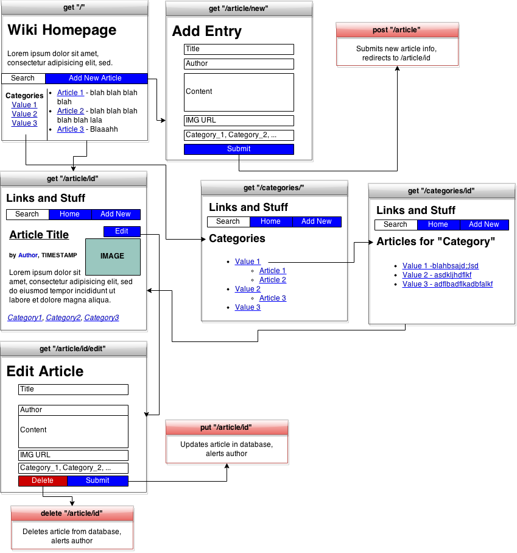
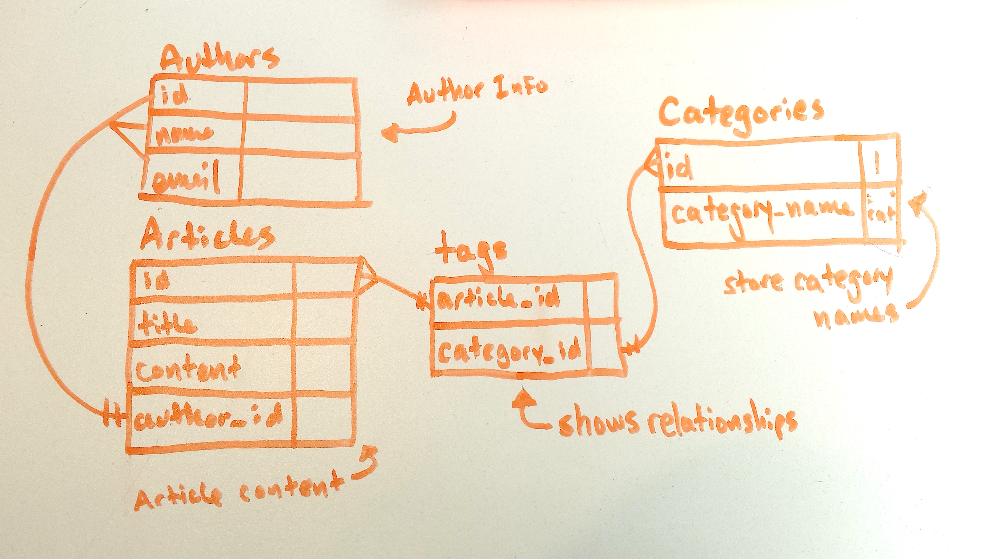

#Wiki Spec

A customized, internally-facing wiki application that allows users to create and edit articles.

##Features

1. User can access this application via their browser using the _internet!_

2. User can add articles to the database.
 - Every article includes a title, author, image, date/time stamp, and 1+ categories.
 - User will be taken directly to the new article they've created.
 - User should be prompted for their email to be contacted in case users have any questions, or to be notified of any changes to their article.
 - User can embed images that will be rendered when the page is loaded?

3. User can edit an article.
 - User will be taken directly back to the article page they've edited, where they can see their changes have been implemented.
 - Timestamp will be updated when article is updated.
 - Original author will be notified via email that their article has been modifried.
 - User can add more categories for the article!
 - User can format their article in markdown.

4. User can view a list of articles in the wiki.

5. User can view a specific article with all its details.

6. User can view a list of categories which will include articles that fall under each category.

7. User can search for a specific category, then be taken to a results page which will include articles that fall under that category.

8. User can view an author's "profile" page, where they can view their articles written and send them an email.

##Wireframe

##ERD

##Routes

|action|path|result|
|-|-|-|
|get|"/"|Send homepage HTML, including 5 most recent articles|
|get|"/articles"|Render list of all articles, send as HTML|
|get|"/articles/id"| Renders a specific article as HTML|
|get|"/articles/new"| Sends a form as HTML to collect input|
|post|"/articles"| Sends form data to server, which is inserted into database. Redirect to get"/articles/id"
|get|"/articles/id/edit"|Sends a form as HTML to collect input/changes to specified article.|
|put|"/articles/id"| Sends changes collected by form at /articles/id/edit to server, which updates record in DB.|
|delete|"/articles/id"|Deletes specified article by ID.|
|get| "/categories"|Displays a list of all categories in use.|
|get| "/categories/id"| Displays all articles that match a particular category.|
|_get_|_/authors/id/articles_|_Info about a specific author including a list of articles_|
|_get_|_/articles/article_id_|_article written by specific author_|
|get| "/articles/search?q=search+term"|Searches database for articles whose category matches search term, then returns them as HTML list of results.|
